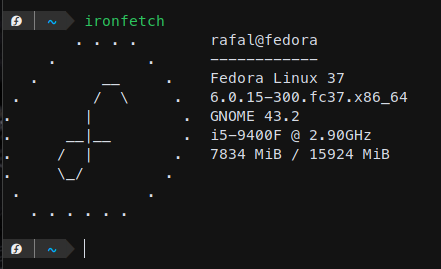

# Ironfetch
A program for displaying system information in a fancy way.



## How to install
0. Install the [Rust toolchain](https://rustup.rs)
1. Execute the following command. It will compile and install ironfetch on your system
```
cargo install ironfetch
```
